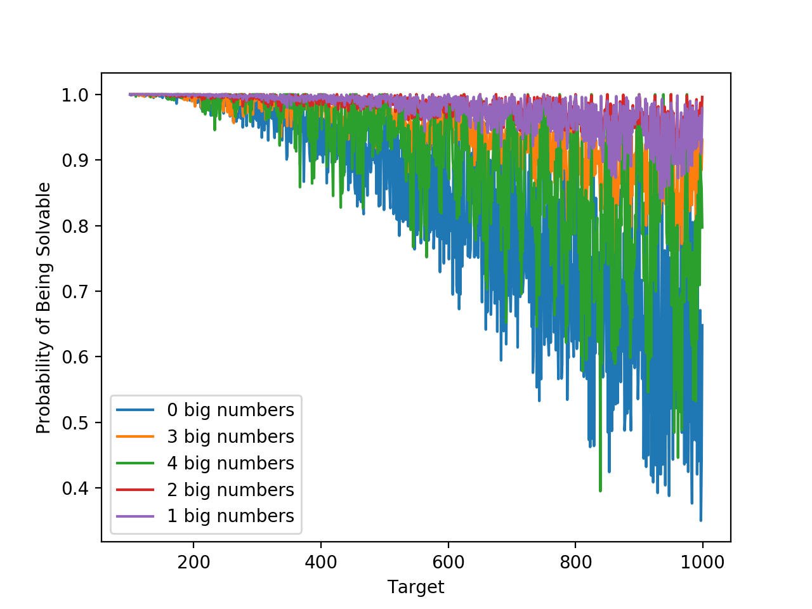

## Best Countdown
In order to solve this, I just simulated millions of possible games to come up with probabilities. 

I used the solver found at (https://www.cs.ox.ac.uk/admissions/undergraduate/courses/countdown.html)[https://www.cs.ox.ac.uk/admissions/undergraduate/courses/countdown.html] and wrote a simple python program to do the analysis.

For the first question:
> What number of “large” cards is most likely to produce a solvable game and what number of “large” cards is least likely to be solvable?
I found:
| # Bigs | # Solved | # Attempted | Success Rate |
|--------|----------|-------------|--------------|
| 0      | 1329626  | 1585218     | 0.838765     |
| 1      | 1546962  | 1582761     | 0.977382     |
| 2      | 1555290  | 1583547     | 0.982156     |
| 3      | 1499468  | 1582761     | 0.947375     |
| 4      | 1434659  | 1585713     | 0.904741     |

Which implies that 2 big numbers are the best, with 98% of all boards being solvable. 4 big numbers was the worst, with only 90% of boards being solvable.

For the second question:
> What three-digit numbers are most or least likely to be solvable?

  
Full 3 Digit Table

|    target |   nSolved |   nAttempted |   success |
| ---------:|----------:|-------------:|----------:|
|       100 |      8572 |         8572 |  1        |
|       101 |      8842 |         8842 |  1        |
|       102 |      8877 |         8877 |  1        |
|       103 |      8777 |         8780 |  0.999658 |
|       104 |      8807 |         8808 |  0.999886 |
|       105 |      8790 |         8791 |  0.999886 |
|       106 |      8832 |         8833 |  0.999887 |
|       107 |      8657 |         8659 |  0.999769 |
|       108 |      8669 |         8669 |  1        |
|       109 |      8731 |         8742 |  0.998742 |
|       110 |      8753 |         8754 |  0.999886 |
|       111 |      8925 |         8926 |  0.999888 |
|       112 |      8815 |         8815 |  1        |
|       113 |      8792 |         8798 |  0.999318 |
|       114 |      8848 |         8848 |  1        |
|       115 |      8755 |         8757 |  0.999772 |
|       116 |      8723 |         8728 |  0.999427 |
|       117 |      8773 |         8777 |  0.999544 |
|       118 |      8687 |         8690 |  0.999655 |
|       119 |      8823 |         8834 |  0.998755 |
|       120 |      8599 |         8600 |  0.999884 |
|       121 |      8857 |         8857 |  1        |
|       122 |      8728 |         8736 |  0.999084 |
|       123 |      8793 |         8800 |  0.999205 |
|       124 |      8842 |         8844 |  0.999774 |
|       125 |      8764 |         8764 |  1        |
|       126 |      8771 |         8772 |  0.999886 |
|       127 |      8827 |         8829 |  0.999773 |
|       128 |      8655 |         8661 |  0.999307 |
|       129 |      8653 |         8654 |  0.999884 |
|       130 |      8717 |         8719 |  0.999771 |
|       131 |      8970 |         8981 |  0.998775 |
|       132 |      8883 |         8895 |  0.998651 |
|       133 |      8520 |         8525 |  0.999413 |
|       134 |      8791 |         8795 |  0.999545 |
|       135 |      8748 |         8753 |  0.999429 |
|       136 |      8828 |         8830 |  0.999773 |
|       137 |      8771 |         8795 |  0.997271 |
|       138 |      8759 |         8762 |  0.999658 |
|       139 |      8736 |         8745 |  0.998971 |
|       140 |      8806 |         8806 |  1        |
|       141 |      8743 |         8761 |  0.997945 |
|       142 |      8855 |         8861 |  0.999323 |
|       143 |      8728 |         8736 |  0.999084 |
|       144 |      8778 |         8779 |  0.999886 |
|       145 |      8776 |         8776 |  1        |
|       146 |      8854 |         8860 |  0.999323 |
|       147 |      8811 |         8817 |  0.999319 |
|       148 |      8865 |         8873 |  0.999098 |
|       149 |      8871 |         8883 |  0.998649 |
|       150 |      8609 |         8611 |  0.999768 |
|       151 |      8734 |         8743 |  0.998971 |
|       152 |      8870 |         8870 |  1        |
|       153 |      8698 |         8702 |  0.99954  |
|       154 |      8839 |         8847 |  0.999096 |
|       155 |      8708 |         8717 |  0.998968 |
|       156 |      8739 |         8742 |  0.999657 |
|       157 |      8720 |         8741 |  0.997598 |
|       158 |      8919 |         8936 |  0.998098 |
|       159 |      8698 |         8711 |  0.998508 |
|       160 |      8790 |         8793 |  0.999659 |
|       161 |      8747 |         8768 |  0.997605 |
|       162 |      8905 |         8914 |  0.99899  |
|       163 |      8815 |         8842 |  0.996946 |
|       164 |      8619 |         8641 |  0.997454 |
|       165 |      8689 |         8711 |  0.997474 |
|       166 |      8681 |         8715 |  0.996099 |
|       167 |      8685 |         8704 |  0.997817 |
|       168 |      8717 |         8728 |  0.99874  |
|       169 |      8768 |         8796 |  0.996817 |
|       170 |      8772 |         8781 |  0.998975 |
|       171 |      8759 |         8774 |  0.99829  |
|       172 |      8811 |         8834 |  0.997396 |
|       173 |      8859 |         8919 |  0.993273 |
|       174 |      8783 |         8789 |  0.999317 |
|       175 |      8845 |         8848 |  0.999661 |
|       176 |      8970 |         8973 |  0.999666 |
|       177 |      8775 |         8786 |  0.998748 |
|       178 |      8898 |         8921 |  0.997422 |
|       179 |      8946 |         8954 |  0.999107 |
|       180 |      8822 |         8832 |  0.998868 |
|       181 |      8828 |         8858 |  0.996613 |
|       182 |      8744 |         8771 |  0.996922 |
|       183 |      8777 |         8811 |  0.996141 |
|       184 |      8817 |         8828 |  0.998754 |
|       185 |      8646 |         8665 |  0.997807 |
|       186 |      9005 |         9022 |  0.998116 |
|       187 |      8720 |         8743 |  0.997369 |
|       188 |      8885 |         8901 |  0.998202 |
|       189 |      8744 |         8755 |  0.998744 |
|       190 |      8705 |         8729 |  0.997251 |
|       191 |      8691 |         8712 |  0.99759  |
|       192 |      8799 |         8802 |  0.999659 |
|       193 |      8749 |         8776 |  0.996923 |
|       194 |      8844 |         8868 |  0.997294 |
|       195 |      8868 |         8885 |  0.998087 |
|       196 |      8650 |         8663 |  0.998499 |
|       197 |      8765 |         8813 |  0.994554 |
|       198 |      8907 |         8919 |  0.998655 |
|       199 |      8631 |         8654 |  0.997342 |
|       200 |      8799 |         8804 |  0.999432 |
|       201 |      8859 |         8881 |  0.997523 |
|       202 |      8705 |         8768 |  0.992815 |
|       203 |      8788 |         8827 |  0.995582 |
|       204 |      8771 |         8778 |  0.999203 |
|       205 |      8745 |         8779 |  0.996127 |
|       206 |      8577 |         8610 |  0.996167 |
|       207 |      8756 |         8779 |  0.99738  |
|       208 |      8823 |         8849 |  0.997062 |
|       209 |      8680 |         8722 |  0.995185 |
|       210 |      8844 |         8857 |  0.998532 |
|       211 |      8754 |         8805 |  0.994208 |
|       212 |      8900 |         8949 |  0.994525 |
|       213 |      8765 |         8848 |  0.990619 |
|       214 |      8715 |         8805 |  0.989779 |
|       215 |      8774 |         8825 |  0.994221 |
|       216 |      8645 |         8654 |  0.99896  |
|       217 |      8805 |         8869 |  0.992784 |
|       218 |      8682 |         8785 |  0.988275 |
|       219 |      8649 |         8681 |  0.996314 |
|       220 |      8757 |         8830 |  0.991733 |
|       221 |      8855 |         8922 |  0.99249  |
|       222 |      8685 |         8718 |  0.996215 |
|       223 |      8661 |         8732 |  0.991869 |
|       224 |      8677 |         8736 |  0.993246 |
|       225 |      8800 |         8805 |  0.999432 |
|       226 |      8480 |         8500 |  0.997647 |
|       227 |      8606 |         8711 |  0.987946 |
|       228 |      8681 |         8700 |  0.997816 |
|       229 |      8696 |         8764 |  0.992241 |
|       230 |      8626 |         8699 |  0.991608 |
|       231 |      8720 |         8762 |  0.995207 |
|       232 |      8712 |         8766 |  0.99384  |
|       233 |      8519 |         8727 |  0.976166 |
|       234 |      8665 |         8699 |  0.996092 |
|       235 |      8772 |         8866 |  0.989398 |
|       236 |      8634 |         8729 |  0.989117 |
|       237 |      8770 |         8873 |  0.988392 |
|       238 |      8739 |         8783 |  0.99499  |
|       239 |      8692 |         8786 |  0.989301 |
|       240 |      8646 |         8673 |  0.996887 |
|       241 |      8649 |         8748 |  0.988683 |
|       242 |      8956 |         9027 |  0.992135 |
|       243 |      8725 |         8782 |  0.993509 |
|       244 |      8796 |         8825 |  0.996714 |
|       245 |      8842 |         8869 |  0.996956 |
|       246 |      8698 |         8719 |  0.997591 |
|       247 |      8787 |         8902 |  0.987082 |
|       248 |      8935 |         8966 |  0.996542 |
|       249 |      8610 |         8642 |  0.996297 |
|       250 |      8675 |         8684 |  0.998964 |
|       251 |      8826 |         8863 |  0.995825 |
|       252 |      8718 |         8730 |  0.998625 |
|       253 |      8801 |         8883 |  0.990769 |
|       254 |      8769 |         8836 |  0.992417 |
|       255 |      8846 |         8891 |  0.994939 |
|       256 |      8875 |         8904 |  0.996743 |
|       257 |      8556 |         8699 |  0.983561 |
|       258 |      8662 |         8720 |  0.993349 |
|       259 |      8771 |         8873 |  0.988504 |
|       260 |      8894 |         8942 |  0.994632 |
|       261 |      8560 |         8658 |  0.988681 |
|       262 |      8628 |         8783 |  0.982352 |
|       263 |      8707 |         8927 |  0.975356 |
|       264 |      8715 |         8758 |  0.99509  |
|       265 |      8803 |         8951 |  0.983466 |
|       266 |      8938 |         9055 |  0.987079 |
|       267 |      8730 |         8868 |  0.984438 |
|       268 |      8702 |         8812 |  0.987517 |
|       269 |      8695 |         8844 |  0.983152 |
|       270 |      8707 |         8746 |  0.995541 |
|       271 |      8632 |         8735 |  0.988208 |
|       272 |      9003 |         9052 |  0.994587 |
|       273 |      8670 |         8739 |  0.992104 |
|       274 |      8695 |         8779 |  0.990432 |
|       275 |      8881 |         8917 |  0.995963 |
|       276 |      8820 |         8835 |  0.998302 |
|       277 |      8506 |         8676 |  0.980406 |
|       278 |      8696 |         8812 |  0.986836 |
|       279 |      8788 |         8831 |  0.995131 |
|       280 |      8748 |         8772 |  0.997264 |
|       281 |      8627 |         8774 |  0.983246 |
|       282 |      8600 |         8685 |  0.990213 |
|       283 |      8704 |         8907 |  0.977209 |
|       284 |      8836 |         8907 |  0.992029 |
|       285 |      8707 |         8801 |  0.989319 |
|       286 |      8785 |         8855 |  0.992095 |
|       287 |      8575 |         8696 |  0.986086 |
|       288 |      8847 |         8875 |  0.996845 |
|       289 |      8608 |         8781 |  0.980298 |
|       290 |      8769 |         8810 |  0.995346 |
|       291 |      8636 |         8783 |  0.983263 |
|       292 |      8695 |         8748 |  0.993941 |
|       293 |      8655 |         8820 |  0.981293 |
|       294 |      8840 |         8853 |  0.998532 |
|       295 |      8721 |         8794 |  0.991699 |
|       296 |      8657 |         8682 |  0.99712  |
|       297 |      8794 |         8847 |  0.994009 |
|       298 |      8663 |         8760 |  0.988927 |
|       299 |      8821 |         8889 |  0.99235  |
|       300 |      8791 |         8802 |  0.99875  |
|       301 |      8504 |         8563 |  0.99311  |
|       302 |      8725 |         8849 |  0.985987 |
|       303 |      8777 |         8903 |  0.985847 |
|       304 |      8792 |         8828 |  0.995922 |
|       305 |      8794 |         8887 |  0.989535 |
|       306 |      8757 |         8777 |  0.997721 |
|       307 |      8720 |         8919 |  0.977688 |
|       308 |      8756 |         8802 |  0.994774 |
|       309 |      8604 |         8724 |  0.986245 |
|       310 |      8696 |         8750 |  0.993829 |
|       311 |      8581 |         8799 |  0.975224 |
|       312 |      8809 |         8853 |  0.99503  |
|       313 |      8760 |         8968 |  0.976806 |
|       314 |      8710 |         8896 |  0.979092 |
|       315 |      8726 |         8807 |  0.990803 |
|       316 |      8681 |         8833 |  0.982792 |
|       317 |      8748 |         8982 |  0.973948 |
|       318 |      8628 |         8790 |  0.98157  |
|       319 |      8480 |         8669 |  0.978198 |
|       320 |      8785 |         8851 |  0.992543 |
|       321 |      8714 |         8866 |  0.982856 |
|       322 |      8789 |         8903 |  0.987195 |
|       323 |      8665 |         8824 |  0.981981 |
|       324 |      8855 |         8872 |  0.998084 |
|       325 |      8740 |         8768 |  0.996807 |
|       326 |      8771 |         8888 |  0.986836 |
|       327 |      8559 |         8720 |  0.981537 |
|       328 |      8805 |         8901 |  0.989215 |
|       329 |      8694 |         8797 |  0.988291 |
|       330 |      8862 |         8961 |  0.988952 |
|       331 |      8527 |         8727 |  0.977083 |
|       332 |      8341 |         8525 |  0.978416 |
|       333 |      8674 |         8843 |  0.980889 |
|       334 |      8589 |         8808 |  0.975136 |
|       335 |      8575 |         8847 |  0.969255 |
|       336 |      8660 |         8710 |  0.994259 |
|       337 |      8580 |         8926 |  0.961237 |
|       338 |      8610 |         8835 |  0.974533 |
|       339 |      8509 |         8771 |  0.970129 |
|       340 |      8647 |         8778 |  0.985076 |
|       341 |      8574 |         8793 |  0.975094 |
|       342 |      8774 |         8848 |  0.991637 |
|       343 |      8765 |         8986 |  0.975406 |
|       344 |      8590 |         8690 |  0.988493 |
|       345 |      8567 |         8723 |  0.982116 |
|       346 |      8640 |         8876 |  0.973411 |
|       347 |      8471 |         8801 |  0.962504 |
|       348 |      8767 |         8826 |  0.993315 |
|       349 |      8635 |         8845 |  0.976258 |
|       350 |      8819 |         8845 |  0.99706  |
|       351 |      8674 |         8787 |  0.98714  |
|       352 |      8584 |         8629 |  0.994785 |
|       353 |      8479 |         8778 |  0.965938 |
|       354 |      8753 |         8838 |  0.990382 |
|       355 |      8725 |         8946 |  0.975296 |
|       356 |      8598 |         8742 |  0.983528 |
|       357 |      8698 |         8817 |  0.986503 |
|       358 |      8871 |         9056 |  0.979572 |
|       359 |      8596 |         8874 |  0.968673 |
|       360 |      8908 |         8958 |  0.994418 |
|       361 |      8351 |         8692 |  0.960769 |
|       362 |      8667 |         8943 |  0.969138 |
|       363 |      8582 |         8803 |  0.974895 |
|       364 |      8828 |         8887 |  0.993361 |
|       365 |      8551 |         8768 |  0.975251 |
|       366 |      8636 |         8802 |  0.981141 |
|       367 |      8176 |         8649 |  0.945312 |
|       368 |      8467 |         8613 |  0.983049 |
|       369 |      8590 |         8686 |  0.988948 |
|       370 |      8515 |         8663 |  0.982916 |
|       371 |      8714 |         8846 |  0.985078 |
|       372 |      8559 |         8641 |  0.99051  |
|       373 |      8558 |         8898 |  0.961789 |
|       374 |      8536 |         8712 |  0.979798 |
|       375 |      8529 |         8630 |  0.988297 |
|       376 |      8671 |         8741 |  0.991992 |
|       377 |      8623 |         8846 |  0.974791 |
|       378 |      8849 |         8901 |  0.994158 |
|       379 |      8373 |         8571 |  0.976899 |
|       380 |      8554 |         8723 |  0.980626 |
|       381 |      8636 |         8952 |  0.964701 |
|       382 |      8473 |         8851 |  0.957293 |
|       383 |      8490 |         8892 |  0.954791 |
|       384 |      8648 |         8692 |  0.994938 |
|       385 |      8610 |         8796 |  0.978854 |
|       386 |      8224 |         8667 |  0.948887 |
|       387 |      8649 |         8838 |  0.978615 |
|       388 |      8488 |         8751 |  0.969946 |
|       389 |      8368 |         8808 |  0.950045 |
|       390 |      8473 |         8582 |  0.987299 |
|       391 |      8421 |         8805 |  0.956388 |
|       392 |      8732 |         8813 |  0.990809 |
|       393 |      8588 |         8865 |  0.968754 |
|       394 |      8573 |         8893 |  0.964017 |
|       395 |      8657 |         8844 |  0.978856 |
|       396 |      8653 |         8685 |  0.996315 |
|       397 |      8725 |         8944 |  0.975514 |
|       398 |      8566 |         8791 |  0.974406 |
|       399 |      8624 |         8698 |  0.991492 |
|       400 |      8750 |         8773 |  0.997378 |
|       401 |      8540 |         8805 |  0.969903 |
|       402 |      8759 |         8884 |  0.98593  |
|       403 |      8447 |         8710 |  0.969805 |
|       404 |      8821 |         8976 |  0.982732 |
|       405 |      8700 |         8828 |  0.985501 |
|       406 |      8519 |         8636 |  0.986452 |
|       407 |      8448 |         8760 |  0.964384 |
|       408 |      8702 |         8772 |  0.99202  |
|       409 |      8210 |         8725 |  0.940974 |
|       410 |      8752 |         8889 |  0.984588 |
|       411 |      8272 |         8671 |  0.953985 |
|       412 |      8391 |         8673 |  0.967485 |
|       413 |      8567 |         8940 |  0.958277 |
|       414 |      8656 |         8944 |  0.9678   |
|       415 |      8347 |         8701 |  0.959315 |
|       416 |      8538 |         8744 |  0.976441 |
|       417 |      8355 |         8862 |  0.942789 |
|       418 |      8360 |         8760 |  0.954338 |
|       419 |      8255 |         8776 |  0.940634 |
|       420 |      8580 |         8662 |  0.990533 |
|       421 |      8403 |         8761 |  0.959137 |
|       422 |      8272 |         8782 |  0.941927 |
|       423 |      8555 |         8746 |  0.978161 |
|       424 |      8555 |         8651 |  0.988903 |
|       425 |      8581 |         8744 |  0.981359 |
|       426 |      8660 |         8800 |  0.984091 |
|       427 |      8445 |         8772 |  0.962722 |
|       428 |      8305 |         8752 |  0.948926 |
|       429 |      8464 |         8746 |  0.967757 |
|       430 |      8274 |         8588 |  0.963437 |
|       431 |      8025 |         8667 |  0.925926 |
|       432 |      8821 |         8875 |  0.993915 |
|       433 |      8019 |         8665 |  0.925447 |
|       434 |      8300 |         8714 |  0.95249  |
|       435 |      8478 |         8785 |  0.965054 |
|       436 |      8298 |         8779 |  0.94521  |
|       437 |      8175 |         8625 |  0.947826 |
|       438 |      8524 |         8746 |  0.974617 |
|       439 |      8455 |         8903 |  0.94968  |
|       440 |      8589 |         8731 |  0.983736 |
|       441 |      8514 |         8747 |  0.973362 |
|       442 |      8477 |         8770 |  0.966591 |
|       443 |      8400 |         8887 |  0.945201 |
|       444 |      8735 |         8868 |  0.985002 |
|       445 |      8453 |         8814 |  0.959042 |
|       446 |      8501 |         8807 |  0.965255 |
|       447 |      8551 |         8861 |  0.965015 |
|       448 |      8825 |         8901 |  0.991462 |
|       449 |      8212 |         8620 |  0.952668 |
|       450 |      8756 |         8788 |  0.996359 |
|       451 |      8488 |         8841 |  0.960072 |
|       452 |      8261 |         8573 |  0.963607 |
|       453 |      8434 |         8810 |  0.957321 |
|       454 |      8442 |         8769 |  0.96271  |
|       455 |      8677 |         8907 |  0.974178 |
|       456 |      8649 |         8712 |  0.992769 |
|       457 |      8101 |         8735 |  0.927418 |
|       458 |      8255 |         8699 |  0.94896  |
|       459 |      8460 |         8713 |  0.970963 |
|       460 |      8639 |         8850 |  0.976158 |
|       461 |      8194 |         8808 |  0.930291 |
|       462 |      8721 |         8835 |  0.987097 |
|       463 |      8223 |         8835 |  0.93073  |
|       464 |      8425 |         8821 |  0.955107 |
|       465 |      8483 |         8838 |  0.959833 |
|       466 |      7965 |         8725 |  0.912894 |
|       467 |      8373 |         8934 |  0.937206 |
|       468 |      8602 |         8688 |  0.990101 |
|       469 |      8243 |         8647 |  0.953279 |
|       470 |      8406 |         8719 |  0.964101 |
|       471 |      8439 |         8906 |  0.947563 |
|       472 |      8431 |         8768 |  0.961565 |
|       473 |      8367 |         8793 |  0.951552 |
|       474 |      8457 |         8714 |  0.970507 |
|       475 |      8663 |         8876 |  0.976003 |
|       476 |      8683 |         8791 |  0.987715 |
|       477 |      8480 |         8770 |  0.966933 |
|       478 |      8321 |         8864 |  0.938741 |
|       479 |      8361 |         8749 |  0.955652 |
|       480 |      8669 |         8779 |  0.98747  |
|       481 |      8417 |         8857 |  0.950322 |
|       482 |      8498 |         8946 |  0.949922 |
|       483 |      8545 |         8826 |  0.968162 |
|       484 |      8324 |         8647 |  0.962646 |
|       485 |      8394 |         8767 |  0.957454 |
|       486 |      8719 |         8949 |  0.974299 |
|       487 |      8221 |         8785 |  0.9358   |
|       488 |      8385 |         8667 |  0.967463 |
|       489 |      8234 |         8731 |  0.943076 |
|       490 |      8635 |         8771 |  0.984494 |
|       491 |      8134 |         8654 |  0.939912 |
|       492 |      8704 |         8798 |  0.989316 |
|       493 |      8292 |         8844 |  0.937585 |
|       494 |      8635 |         8923 |  0.967724 |
|       495 |      8443 |         8698 |  0.970683 |
|       496 |      8734 |         8866 |  0.985112 |
|       497 |      8565 |         8818 |  0.971309 |
|       498 |      8675 |         8842 |  0.981113 |
|       499 |      8359 |         8797 |  0.95021  |
|       500 |      8815 |         8882 |  0.992457 |
|       501 |      8478 |         8748 |  0.969136 |
|       502 |      8379 |         8731 |  0.959684 |
|       503 |      8416 |         8777 |  0.95887  |
|       504 |      8769 |         8802 |  0.996251 |
|       505 |      8295 |         8669 |  0.956858 |
|       506 |      8511 |         8758 |  0.971797 |
|       507 |      8355 |         8776 |  0.952028 |
|       508 |      8434 |         8786 |  0.959936 |
|       509 |      8190 |         8787 |  0.932059 |
|       510 |      8680 |         8851 |  0.98068  |
|       511 |      8366 |         8818 |  0.948741 |
|       512 |      8575 |         8879 |  0.965762 |
|       513 |      8348 |         8752 |  0.953839 |
|       514 |      8293 |         8884 |  0.933476 |
|       515 |      8438 |         8923 |  0.945646 |
|       516 |      8477 |         8795 |  0.963843 |
|       517 |      8325 |         8887 |  0.936762 |
|       518 |      8565 |         8970 |  0.954849 |
|       519 |      8237 |         8746 |  0.941802 |
|       520 |      8591 |         8816 |  0.974478 |
|       521 |      8262 |         8871 |  0.931349 |
|       522 |      8725 |         8991 |  0.970415 |
|       523 |      8311 |         8870 |  0.936979 |
|       524 |      8346 |         8775 |  0.951111 |
|       525 |      8595 |         8775 |  0.979487 |
|       526 |      8278 |         8835 |  0.936955 |
|       527 |      8117 |         8669 |  0.936325 |
|       528 |      8502 |         8607 |  0.987801 |
|       529 |      8330 |         8873 |  0.938803 |
|       530 |      8571 |         8985 |  0.953923 |
|       531 |      8378 |         8840 |  0.947738 |
|       532 |      8500 |         8831 |  0.962518 |
|       533 |      7868 |         8642 |  0.910437 |
|       534 |      8376 |         8925 |  0.938487 |
|       535 |      8157 |         8861 |  0.920551 |
|       536 |      8337 |         8837 |  0.94342  |
|       537 |      7943 |         8576 |  0.926189 |
|       538 |      8058 |         8852 |  0.910303 |
|       539 |      8510 |         8838 |  0.962888 |
|       540 |      8255 |         8550 |  0.965497 |
|       541 |      7892 |         8835 |  0.893265 |
|       542 |      8005 |         8830 |  0.906569 |
|       543 |      7917 |         8792 |  0.900478 |
|       544 |      8390 |         8752 |  0.958638 |
|       545 |      7963 |         8818 |  0.903039 |
|       546 |      8808 |         8972 |  0.981721 |
|       547 |      8110 |         8813 |  0.920231 |
|       548 |      8332 |         8869 |  0.939452 |
|       549 |      8442 |         8890 |  0.949606 |
|       550 |      8772 |         8871 |  0.98884  |
|       551 |      8215 |         8926 |  0.920345 |
|       552 |      8795 |         8944 |  0.983341 |
|       553 |      8435 |         8951 |  0.942353 |
|       554 |      8070 |         8862 |  0.91063  |
|       555 |      8241 |         8906 |  0.925331 |
|       556 |      8151 |         8859 |  0.920081 |
|       557 |      7730 |         8782 |  0.88021  |
|       558 |      8464 |         8810 |  0.960726 |
|       559 |      7933 |         8678 |  0.914151 |
|       560 |      8443 |         8732 |  0.966903 |
|       561 |      8359 |         8882 |  0.941117 |
|       562 |      7957 |         8751 |  0.909268 |
|       563 |      7761 |         8946 |  0.867539 |
|       564 |      8410 |         8773 |  0.958623 |
|       565 |      7954 |         8739 |  0.910173 |
|       566 |      7904 |         8882 |  0.88989  |
|       567 |      8264 |         8694 |  0.950541 |
|       568 |      8318 |         8769 |  0.948569 |
|       569 |      7974 |         8830 |  0.903058 |
|       570 |      8347 |         8703 |  0.959095 |
|       571 |      7990 |         8741 |  0.914083 |
|       572 |      8296 |         8744 |  0.948765 |
|       573 |      8245 |         8898 |  0.926613 |
|       574 |      8456 |         8697 |  0.972289 |
|       575 |      8541 |         8805 |  0.970017 |
|       576 |      8776 |         8856 |  0.990967 |
|       577 |      8176 |         8868 |  0.921967 |
|       578 |      8103 |         8865 |  0.914044 |
|       579 |      8181 |         8772 |  0.932627 |
|       580 |      8606 |         9022 |  0.95389  |
|       581 |      8261 |         8841 |  0.934397 |
|       582 |      8212 |         8772 |  0.936161 |
|       583 |      8030 |         8852 |  0.90714  |
|       584 |      8324 |         8689 |  0.957993 |
|       585 |      8461 |         8882 |  0.952601 |
|       586 |      7818 |         8666 |  0.902146 |
|       587 |      7819 |         8845 |  0.884002 |
|       588 |      8799 |         9023 |  0.975175 |
|       589 |      7846 |         8802 |  0.891388 |
|       590 |      8499 |         8874 |  0.957742 |
|       591 |      8236 |         8938 |  0.921459 |
|       592 |      8244 |         8680 |  0.94977  |
|       593 |      8062 |         8899 |  0.905944 |
|       594 |      8681 |         8886 |  0.97693  |
|       595 |      8320 |         8672 |  0.95941  |
|       596 |      8449 |         8882 |  0.95125  |
|       597 |      8219 |         8866 |  0.927025 |
|       598 |      8449 |         8834 |  0.956418 |
|       599 |      8178 |         8851 |  0.923963 |
|       600 |      8792 |         8819 |  0.996938 |
|       601 |      8044 |         8774 |  0.9168   |
|       602 |      8304 |         8615 |  0.9639   |
|       603 |      8426 |         8831 |  0.954139 |
|       604 |      8342 |         8851 |  0.942492 |
|       605 |      8314 |         8782 |  0.946709 |
|       606 |      8521 |         8976 |  0.949309 |
|       607 |      8006 |         8963 |  0.893228 |
|       608 |      8511 |         8950 |  0.95095  |
|       609 |      8379 |         8989 |  0.932139 |
|       610 |      8149 |         8664 |  0.940559 |
|       611 |      7985 |         8829 |  0.904406 |
|       612 |      8563 |         8750 |  0.978629 |
|       613 |      7745 |         8715 |  0.888698 |
|       614 |      7879 |         8913 |  0.88399  |
|       615 |      8245 |         8714 |  0.946179 |
|       616 |      8561 |         8863 |  0.965926 |
|       617 |      7819 |         8955 |  0.873143 |
|       618 |      8164 |         8737 |  0.934417 |
|       619 |      7734 |         8722 |  0.886723 |
|       620 |      8143 |         8644 |  0.942041 |
|       621 |      8287 |         8738 |  0.948386 |
|       622 |      7739 |         8549 |  0.905252 |
|       623 |      8293 |         8912 |  0.930543 |
|       624 |      8648 |         8745 |  0.988908 |
|       625 |      8462 |         8820 |  0.95941  |
|       626 |      8261 |         8846 |  0.933868 |
|       627 |      8082 |         8698 |  0.929179 |
|       628 |      8049 |         8601 |  0.935821 |
|       629 |      8333 |         8916 |  0.934612 |
|       630 |      8605 |         8810 |  0.976731 |
|       631 |      7665 |         8580 |  0.893357 |
|       632 |      8251 |         8747 |  0.943295 |
|       633 |      7947 |         8895 |  0.893423 |
|       634 |      7654 |         8650 |  0.884855 |
|       635 |      8153 |         8923 |  0.913706 |
|       636 |      8361 |         8938 |  0.935444 |
|       637 |      8034 |         8669 |  0.92675  |
|       638 |      7928 |         8750 |  0.906057 |
|       639 |      7928 |         8597 |  0.922182 |
|       640 |      8230 |         8737 |  0.941971 |
|       641 |      7684 |         8816 |  0.871597 |
|       642 |      8239 |         8965 |  0.919018 |
|       643 |      7531 |         8767 |  0.859017 |
|       644 |      8477 |         8981 |  0.943882 |
|       645 |      8033 |         8840 |  0.90871  |
|       646 |      7988 |         8775 |  0.910313 |
|       647 |      7797 |         8718 |  0.894357 |
|       648 |      8662 |         8762 |  0.988587 |
|       649 |      8116 |         8918 |  0.91007  |
|       650 |      8702 |         8868 |  0.981281 |
|       651 |      8383 |         9013 |  0.930101 |
|       652 |      8073 |         8709 |  0.926972 |
|       653 |      7769 |         8836 |  0.879244 |
|       654 |      7999 |         8656 |  0.924099 |
|       655 |      7744 |         8885 |  0.871581 |
|       656 |      8274 |         8786 |  0.941725 |
|       657 |      8169 |         8878 |  0.92014  |
|       658 |      8151 |         8679 |  0.939163 |
|       659 |      7219 |         8680 |  0.831682 |
|       660 |      8401 |         8826 |  0.951847 |
|       661 |      7337 |         8824 |  0.831482 |
|       662 |      7508 |         8808 |  0.852407 |
|       663 |      7925 |         8791 |  0.90149  |
|       664 |      7955 |         8724 |  0.911852 |
|       665 |      7979 |         8708 |  0.916284 |
|       666 |      8253 |         8833 |  0.934337 |
|       667 |      7565 |         8795 |  0.860148 |
|       668 |      7746 |         8720 |  0.888303 |
|       669 |      7608 |         8639 |  0.880657 |
|       670 |      8215 |         8769 |  0.936823 |
|       671 |      7982 |         8718 |  0.915577 |
|       672 |      8499 |         8686 |  0.978471 |
|       673 |      7961 |         8822 |  0.902403 |
|       674 |      7987 |         8831 |  0.904428 |
|       675 |      8563 |         8812 |  0.971743 |
|       676 |      8182 |         8679 |  0.942735 |
|       677 |      7753 |         8721 |  0.889004 |
|       678 |      7872 |         8728 |  0.901925 |
|       679 |      8152 |         8811 |  0.925207 |
|       680 |      8462 |         8852 |  0.955942 |
|       681 |      7688 |         8785 |  0.875128 |
|       682 |      7772 |         8717 |  0.891591 |
|       683 |      7286 |         8838 |  0.824395 |
|       684 |      8312 |         8858 |  0.938361 |
|       685 |      7663 |         8747 |  0.876072 |
|       686 |      8102 |         8756 |  0.925308 |
|       687 |      7537 |         8786 |  0.857842 |
|       688 |      8088 |         8769 |  0.92234  |
|       689 |      7544 |         8963 |  0.841682 |
|       690 |      8345 |         8776 |  0.950889 |
|       691 |      7114 |         8814 |  0.807125 |
|       692 |      7962 |         8838 |  0.900883 |
|       693 |      8580 |         8972 |  0.956309 |
|       694 |      7953 |         8820 |  0.901701 |
|       695 |      7696 |         8809 |  0.873652 |
|       696 |      8516 |         8863 |  0.960848 |
|       697 |      7777 |         8588 |  0.905566 |
|       698 |      8069 |         8847 |  0.912061 |
|       699 |      8174 |         8912 |  0.91719  |
|       700 |      8790 |         8906 |  0.986975 |
|       701 |      7956 |         8889 |  0.895039 |
|       702 |      8539 |         8763 |  0.974438 |
|       703 |      7838 |         8723 |  0.898544 |
|       704 |      8562 |         8909 |  0.961051 |
|       705 |      8237 |         8895 |  0.926026 |
|       706 |      7804 |         8830 |  0.883805 |
|       707 |      7730 |         8728 |  0.885655 |
|       708 |      8339 |         8913 |  0.9356   |
|       709 |      7486 |         8812 |  0.849523 |
|       710 |      8026 |         8767 |  0.915478 |
|       711 |      7707 |         8715 |  0.884337 |
|       712 |      7991 |         8809 |  0.90714  |
|       713 |      7385 |         8857 |  0.833804 |
|       714 |      8418 |         8823 |  0.954097 |
|       715 |      7752 |         8868 |  0.874154 |
|       716 |      7738 |         8706 |  0.888812 |
|       717 |      7433 |         8839 |  0.840932 |
|       718 |      7596 |         8752 |  0.867916 |
|       719 |      7893 |         8907 |  0.886157 |
|       720 |      8509 |         8686 |  0.979622 |
|       721 |      8141 |         8712 |  0.934458 |
|       722 |      7987 |         8901 |  0.897315 |
|       723 |      7977 |         8824 |  0.904012 |
|       724 |      8113 |         8796 |  0.922351 |
|       725 |      8173 |         8709 |  0.938454 |
|       726 |      8413 |         8701 |  0.9669   |
|       727 |      7944 |         8892 |  0.893387 |
|       728 |      8635 |         8931 |  0.966857 |
|       729 |      8267 |         8796 |  0.939859 |
|       730 |      8486 |         9003 |  0.942575 |
|       731 |      7455 |         8673 |  0.859564 |
|       732 |      8029 |         8809 |  0.911454 |
|       733 |      7268 |         8769 |  0.828829 |
|       734 |      7504 |         8775 |  0.855157 |
|       735 |      8188 |         8802 |  0.930243 |
|       736 |      7957 |         8704 |  0.914177 |
|       737 |      7405 |         8841 |  0.837575 |
|       738 |      7953 |         8710 |  0.913088 |
|       739 |      7013 |         8837 |  0.793595 |
|       740 |      8009 |         8738 |  0.916571 |
|       741 |      7702 |         8687 |  0.886612 |
|       742 |      8041 |         8783 |  0.915519 |
|       743 |      7130 |         8851 |  0.805559 |
|       744 |      8488 |         8824 |  0.961922 |
|       745 |      7634 |         8806 |  0.866909 |
|       746 |      7757 |         8815 |  0.879977 |
|       747 |      8102 |         8819 |  0.918698 |
|       748 |      8376 |         8953 |  0.935552 |
|       749 |      8076 |         8866 |  0.910896 |
|       750 |      8561 |         8763 |  0.976949 |
|       751 |      7719 |         8749 |  0.882272 |
|       752 |      8255 |         8701 |  0.948742 |
|       753 |      7757 |         8735 |  0.888037 |
|       754 |      7978 |         8690 |  0.918067 |
|       755 |      7719 |         8642 |  0.893196 |
|       756 |      8691 |         8872 |  0.979599 |
|       757 |      7526 |         8706 |  0.864461 |
|       758 |      7492 |         8676 |  0.863532 |
|       759 |      7750 |         8808 |  0.879882 |
|       760 |      8266 |         8777 |  0.94178  |
|       761 |      7262 |         8825 |  0.82289  |
|       762 |      7963 |         8905 |  0.894217 |
|       763 |      7508 |         8817 |  0.851537 |
|       764 |      7645 |         8816 |  0.867173 |
|       765 |      7947 |         8625 |  0.921391 |
|       766 |      7469 |         8837 |  0.845196 |
|       767 |      7204 |         8792 |  0.819381 |
|       768 |      8308 |         8752 |  0.949269 |
|       769 |      7224 |         8871 |  0.814339 |
|       770 |      8341 |         8736 |  0.954785 |
|       771 |      7509 |         8752 |  0.857975 |
|       772 |      7533 |         8821 |  0.853985 |
|       773 |      7407 |         8807 |  0.841036 |
|       774 |      8245 |         8689 |  0.948901 |
|       775 |      8185 |         8807 |  0.929374 |
|       776 |      8058 |         8770 |  0.918814 |
|       777 |      7812 |         8824 |  0.885313 |
|       778 |      7202 |         8862 |  0.812683 |
|       779 |      7290 |         8848 |  0.823915 |
|       780 |      8314 |         8743 |  0.950932 |
|       781 |      7482 |         8720 |  0.858028 |
|       782 |      7510 |         8764 |  0.856915 |
|       783 |      7584 |         8728 |  0.868928 |
|       784 |      8061 |         8653 |  0.931584 |
|       785 |      7220 |         8868 |  0.814163 |
|       786 |      7473 |         8728 |  0.85621  |
|       787 |      6726 |         8858 |  0.759314 |
|       788 |      7534 |         8981 |  0.838882 |
|       789 |      7258 |         8775 |  0.827123 |
|       790 |      7978 |         8791 |  0.907519 |
|       791 |      7523 |         8868 |  0.848331 |
|       792 |      8568 |         8886 |  0.964213 |
|       793 |      7570 |         8920 |  0.848655 |
|       794 |      7596 |         8915 |  0.852047 |
|       795 |      8033 |         8936 |  0.898948 |
|       796 |      7787 |         8898 |  0.87514  |
|       797 |      7597 |         8804 |  0.862903 |
|       798 |      8393 |         8883 |  0.944838 |
|       799 |      7659 |         8796 |  0.870737 |
|       800 |      8777 |         8900 |  0.98618  |
|       801 |      8135 |         8921 |  0.911893 |
|       802 |      7630 |         8713 |  0.875703 |
|       803 |      8084 |         8967 |  0.901528 |
|       804 |      8109 |         8856 |  0.91565  |
|       805 |      7622 |         8720 |  0.874083 |
|       806 |      7669 |         8815 |  0.869994 |
|       807 |      7251 |         8772 |  0.826607 |
|       808 |      7999 |         8833 |  0.905581 |
|       809 |      6845 |         8733 |  0.783809 |
|       810 |      8330 |         8661 |  0.961783 |
|       811 |      6805 |         8883 |  0.76607  |
|       812 |      8016 |         8899 |  0.900775 |
|       813 |      6912 |         8767 |  0.788411 |
|       814 |      7429 |         8707 |  0.853222 |
|       815 |      7092 |         8726 |  0.812744 |
|       816 |      8253 |         8746 |  0.943631 |
|       817 |      6923 |         8935 |  0.774818 |
|       818 |      6972 |         8814 |  0.791014 |
|       819 |      7760 |         8650 |  0.89711  |
|       820 |      7879 |         8904 |  0.884883 |
|       821 |      6938 |         8747 |  0.793186 |
|       822 |      7082 |         8681 |  0.815805 |
|       823 |      7187 |         8908 |  0.806803 |
|       824 |      7861 |         8723 |  0.901181 |
|       825 |      8356 |         8837 |  0.94557  |
|       826 |      7758 |         8655 |  0.89636  |
|       827 |      6948 |         8594 |  0.808471 |
|       828 |      8108 |         8792 |  0.922202 |
|       829 |      6958 |         8896 |  0.782149 |
|       830 |      7648 |         8844 |  0.864767 |
|       831 |      7103 |         8746 |  0.812143 |
|       832 |      8139 |         8947 |  0.90969  |
|       833 |      7635 |         8801 |  0.867515 |
|       834 |      7764 |         8878 |  0.874521 |
|       835 |      6996 |         8720 |  0.802294 |
|       836 |      7718 |         8953 |  0.862057 |
|       837 |      7640 |         8877 |  0.860651 |
|       838 |      7165 |         8908 |  0.804333 |
|       839 |      6613 |         8785 |  0.75276  |
|       840 |      8414 |         8811 |  0.954943 |
|       841 |      6925 |         8809 |  0.786128 |
|       842 |      7246 |         8817 |  0.821821 |
|       843 |      7307 |         8925 |  0.818711 |
|       844 |      7329 |         8893 |  0.824131 |
|       845 |      7277 |         8740 |  0.832609 |
|       846 |      8139 |         8859 |  0.918727 |
|       847 |      7850 |         8809 |  0.891134 |
|       848 |      8116 |         8904 |  0.9115   |
|       849 |      7409 |         8854 |  0.836797 |
|       850 |      8480 |         8842 |  0.959059 |
|       851 |      7153 |         8881 |  0.805427 |
|       852 |      7956 |         8644 |  0.920407 |
|       853 |      6868 |         8726 |  0.787073 |
|       854 |      7543 |         8753 |  0.861762 |
|       855 |      8119 |         8981 |  0.90402  |
|       856 |      7625 |         8923 |  0.854533 |
|       857 |      6533 |         8849 |  0.738276 |
|       858 |      7998 |         8863 |  0.902403 |
|       859 |      6930 |         8680 |  0.798387 |
|       860 |      7518 |         8793 |  0.854998 |
|       861 |      7271 |         8869 |  0.819822 |
|       862 |      6537 |         8909 |  0.733752 |
|       863 |      6509 |         8867 |  0.73407  |
|       864 |      8314 |         8891 |  0.935103 |
|       865 |      7020 |         8737 |  0.803479 |
|       866 |      6659 |         8664 |  0.768583 |
|       867 |      7363 |         8913 |  0.826097 |
|       868 |      7598 |         8808 |  0.862625 |
|       869 |      7011 |         8727 |  0.803369 |
|       870 |      8110 |         8869 |  0.914421 |
|       871 |      7396 |         8957 |  0.825723 |
|       872 |      7693 |         8976 |  0.857063 |
|       873 |      7756 |         8782 |  0.88317  |
|       874 |      7549 |         8674 |  0.870302 |
|       875 |      8177 |         8771 |  0.932277 |
|       876 |      8153 |         8791 |  0.927426 |
|       877 |      7208 |         8776 |  0.821331 |
|       878 |      6804 |         8734 |  0.779025 |
|       879 |      7401 |         8911 |  0.830547 |
|       880 |      8119 |         8853 |  0.91709  |
|       881 |      6897 |         8775 |  0.785983 |
|       882 |      8468 |         8913 |  0.950073 |
|       883 |      7075 |         8869 |  0.797722 |
|       884 |      7575 |         8854 |  0.855546 |
|       885 |      7659 |         8796 |  0.870737 |
|       886 |      6703 |         8751 |  0.76597  |
|       887 |      6779 |         9040 |  0.749889 |
|       888 |      7901 |         8755 |  0.902456 |
|       889 |      6892 |         8614 |  0.800093 |
|       890 |      7805 |         8871 |  0.879833 |
|       891 |      7742 |         8824 |  0.87738  |
|       892 |      7296 |         8756 |  0.833257 |
|       893 |      7155 |         8803 |  0.812791 |
|       894 |      7567 |         8713 |  0.868472 |
|       895 |      7368 |         8678 |  0.849044 |
|       896 |      8463 |         8913 |  0.949512 |
|       897 |      7900 |         8811 |  0.896607 |
|       898 |      7693 |         8913 |  0.863121 |
|       899 |      7717 |         8771 |  0.879831 |
|       900 |      8621 |         8716 |  0.989101 |
|       901 |      7777 |         8886 |  0.875197 |
|       902 |      8026 |         8906 |  0.90119  |
|       903 |      7847 |         8677 |  0.904345 |
|       904 |      7911 |         8773 |  0.901744 |
|       905 |      7431 |         8890 |  0.835883 |
|       906 |      7651 |         8769 |  0.872505 |
|       907 |      6913 |         8832 |  0.782722 |
|       908 |      7206 |         8769 |  0.821758 |
|       909 |      7394 |         8768 |  0.843294 |
|       910 |      7952 |         8831 |  0.900464 |
|       911 |      6504 |         8875 |  0.732845 |
|       912 |      8039 |         8747 |  0.919058 |
|       913 |      6572 |         8720 |  0.75367  |
|       914 |      6418 |         8798 |  0.729484 |
|       915 |      7123 |         8629 |  0.825472 |
|       916 |      6754 |         8795 |  0.767936 |
|       917 |      6884 |         8672 |  0.793819 |
|       918 |      8114 |         8761 |  0.92615  |
|       919 |      6510 |         8816 |  0.73843  |
|       920 |      8140 |         8915 |  0.913068 |
|       921 |      6848 |         8649 |  0.791768 |
|       922 |      6685 |         8778 |  0.761563 |
|       923 |      7333 |         8867 |  0.826999 |
|       924 |      8608 |         9093 |  0.946662 |
|       925 |      7854 |         8728 |  0.899863 |
|       926 |      6810 |         8797 |  0.774128 |
|       927 |      7672 |         8774 |  0.874402 |
|       928 |      7571 |         8842 |  0.856254 |
|       929 |      6912 |         8844 |  0.781547 |
|       930 |      7934 |         8754 |  0.906329 |
|       931 |      7295 |         8625 |  0.845797 |
|       932 |      7087 |         8862 |  0.799707 |
|       933 |      7018 |         8875 |  0.790761 |
|       934 |      7047 |         8843 |  0.796902 |
|       935 |      7524 |         8746 |  0.860279 |
|       936 |      8674 |         8963 |  0.967756 |
|       937 |      6889 |         8732 |  0.788937 |
|       938 |      7565 |         8618 |  0.877814 |
|       939 |      7242 |         8893 |  0.814348 |
|       940 |      8039 |         8914 |  0.90184  |
|       941 |      6861 |         8930 |  0.768309 |
|       942 |      7611 |         8823 |  0.862632 |
|       943 |      6879 |         8919 |  0.771275 |
|       944 |      7611 |         8799 |  0.864985 |
|       945 |      7981 |         8886 |  0.898154 |
|       946 |      7317 |         8805 |  0.831005 |
|       947 |      6717 |         8786 |  0.764512 |
|       948 |      7812 |         8712 |  0.896694 |
|       949 |      7318 |         8827 |  0.829047 |
|       950 |      8362 |         8840 |  0.945928 |
|       951 |      6844 |         8732 |  0.783784 |
|       952 |      8074 |         8789 |  0.918648 |
|       953 |      6793 |         8818 |  0.770356 |
|       954 |      7883 |         8785 |  0.897325 |
|       955 |      6586 |         8801 |  0.748324 |
|       956 |      6723 |         8803 |  0.763717 |
|       957 |      7093 |         8706 |  0.814725 |
|       958 |      6849 |         8747 |  0.783011 |
|       959 |      6671 |         8719 |  0.765111 |
|       960 |      8282 |         8905 |  0.930039 |
|       961 |      6152 |         8747 |  0.703327 |
|       962 |      7015 |         8757 |  0.801073 |
|       963 |      7079 |         8749 |  0.809121 |
|       964 |      6717 |         8765 |  0.766343 |
|       965 |      6596 |         8682 |  0.759733 |
|       966 |      7669 |         8875 |  0.864113 |
|       967 |      6255 |         8891 |  0.70352  |
|       968 |      7631 |         8829 |  0.864311 |
|       969 |      7112 |         8877 |  0.801172 |
|       970 |      7756 |         8969 |  0.864756 |
|       971 |      6648 |         8796 |  0.755798 |
|       972 |      8071 |         8839 |  0.913112 |
|       973 |      7247 |         8738 |  0.829366 |
|       974 |      7118 |         8975 |  0.793092 |
|       975 |      8162 |         8721 |  0.935902 |
|       976 |      7740 |         8869 |  0.872703 |
|       977 |      6650 |         8698 |  0.764544 |
|       978 |      7095 |         8933 |  0.794246 |
|       979 |      6909 |         8829 |  0.782535 |
|       980 |      8004 |         8762 |  0.91349  |
|       981 |      7184 |         8910 |  0.806285 |
|       982 |      6416 |         8555 |  0.749971 |
|       983 |      6458 |         8892 |  0.726271 |
|       984 |      8014 |         8952 |  0.895219 |
|       985 |      6540 |         8724 |  0.749656 |
|       986 |      6888 |         8748 |  0.78738  |
|       987 |      7287 |         8876 |  0.820978 |
|       988 |      7504 |         8761 |  0.856523 |
|       989 |      6396 |         8806 |  0.726323 |
|       990 |      8001 |         8656 |  0.92433  |
|       991 |      6592 |         8737 |  0.754492 |
|       992 |      7841 |         8917 |  0.879332 |
|       993 |      7013 |         8883 |  0.789486 |
|       994 |      7700 |         8745 |  0.880503 |
|       995 |      6846 |         8721 |  0.785002 |
|       996 |      7851 |         8741 |  0.898181 |
|       997 |      7010 |         8837 |  0.793256 |
|       998 |      7056 |         8630 |  0.817613 |
|       999 |      7595 |         8696 |  0.87339  |

The most successful 3 digit numbers are 100,101,102,108,112,114,121,125,140,145,152 which had a successful solve for combination of numbers I tried. The least successful were 961 and 967 down at around 70% success.

# Extension
We can keep track of the number of big numbers and the target number jointly to understand how they affect eachother. 

